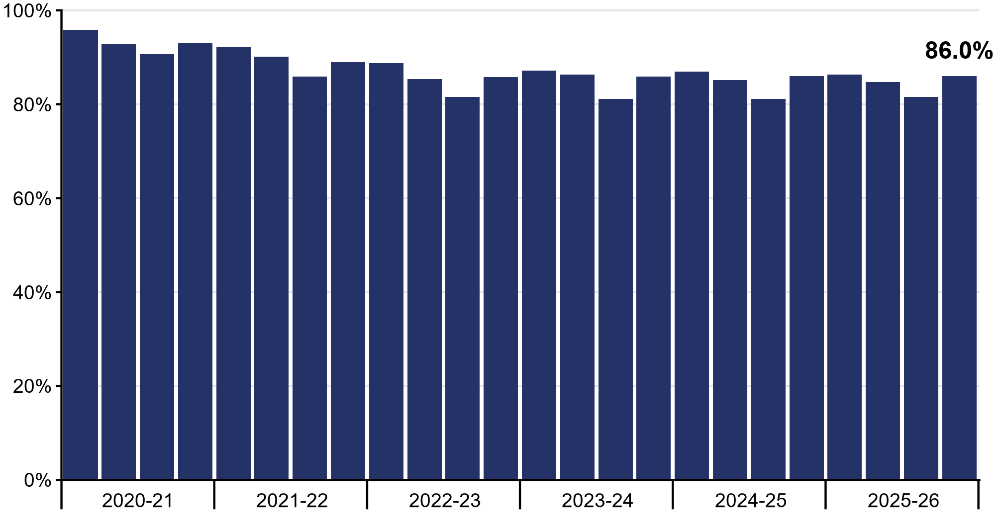
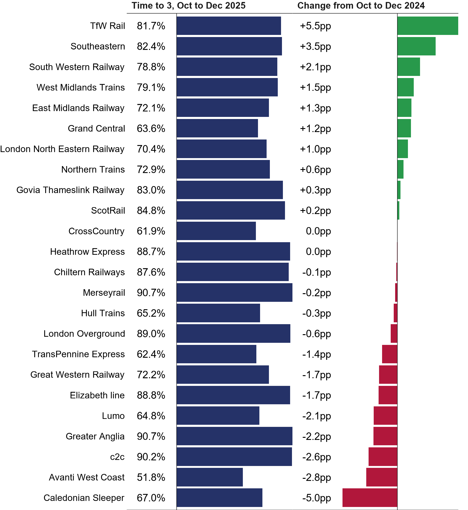
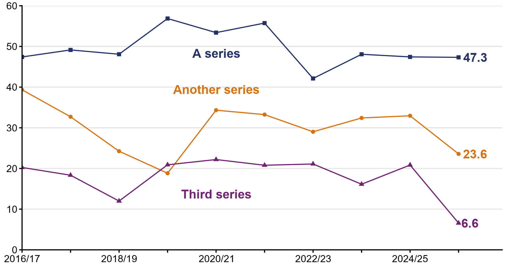
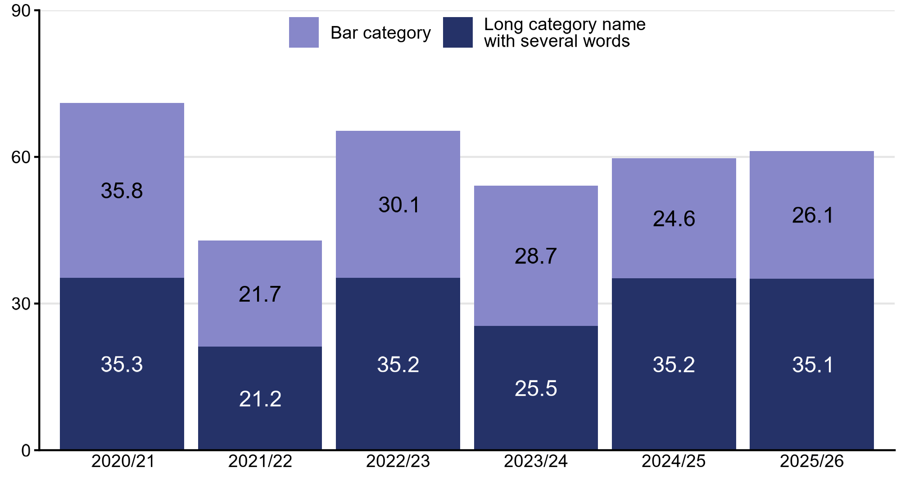

# orrcharts

<!-- badges: start -->
<!-- badges: end -->

The goal of orrcharts is to standardise and streamline creating charts for ORR statistical publications.

## Installation

You can install the development version of orrcharts like so using the `remotes` package:

``` r
install.packages("remotes") # install remotes if not already
remotes::install_github("officeofrailandroad/orrcharts")

```

## Examples

### Quarterly Bar Charts

Plot a bar chart with bars grouped by financial year and a data label of the final bar.

This chart expects a data frame of two columns. The first column hold financial quarter keys (of the form `20253` or `202520263`) and the second column contains the value which sets the height of the bars. For example, this query retrieves the quarterly GB Time to 3 since the start of 2020/21.

```sql
select t.financial_quarter_key
 , t.time_to_3_percent
from dwh.nr.factv_350_on_time_operator_quarterly t
where t.operator_name = 'Great Britain'
and t.financial_quarter_key >= 202020211
and t.financial_quarter_key <= 202520263
```

This data is in the right format to be used by the `quarterly_bar` function. This function outputs a PNG image which holds the chart. The `y_axis_breaks` argument allows the user to specify where y-axis lines should occur, and `y_axis_labeller` expect a function which controls how the axis labels should be displayed.

```r
plot_data <- readr::read_csv("gb_time_to_3.csv")

quarterly_bar(
  data = plot_data,
  filename = "time_to_3_chart.png",
  y_axis_breaks = seq(from = 0, to = 100, by = 20),
  y_axis_labeller = scales::label_percent(scale = 1)
)

```




### Side-By-Side Bar Charts

Many stats releases use side-by-side bar charts to compare metrics and their from the previous year across categories, such as train operators. 

The `side_by_side_bar` function expects a data frame with 3 columns:
1. The category, typically train operating company name
2. The value, which populates the left-hand bars
3. The change in the value (either in percent or percentage points), which sets the right-hand bars.

```r
side_by_side_bar(
  data = toc_time_to_3,
  filename = "toc_time_to_3.png",
  left_bar_title = "Time to 3, Oct to Dec 2025", # set the title above left bars
  right_bar_title = "Change from Oct to Dec 2024", # set the title above right bars
  left_bar_labeller = scales::label_percent(scale = 1, accuracy = 0.1), # formatter for left data labels
  right_bar_labeller = label_orr_percentage_point() # formatter for right data labels
)
```



### Line Chart

A simple line chart with series and last point data labels, used to plot time series.

The `line_chart` functions expects a data frame with at least 2 columns. The first column sets the x-axis, this is usually a date or time period. Each subsequent column sets the values for the line series - the column names are used as series labels.

The series and data labels use `ggrepel::geom_text_repel()` to avoid overlapping points and other labels. This algorithm uses random numbers and is not always perfect.

```r
# Generate data for the chart
line_chart_data <- tibble(
  year = c("2016/17", "2017/18", "2018/19", "2019/20", "2020/21", "2021/22", "2022/23", "2023/24", "2024/25", "2025/26"),
  `A series` = rnorm(10, 50, 5),
  `Another series` = rnorm(10, 30, 5),
  `Third series` = rnorm(10, 20, 5)
)

# Create the chart
line_chart(
  data = line_chart_data,
  filename = "line_chart.png",
  y_axis_breaks = seq(from = 0, to = 60, by = 10), # set where lines appear on y-axis
  x_axis_labels = c("2016/17", "2018/19", "2020/21", "2022/23", "2024/25"), # set which x-axis labels appear
  show_series_labels = TRUE # display the series names
)
```



### Bar chart

A simple stacked bar chart with data labels.

The `bar_chart` function expects a data frame with at least 2 columns. The first column sets the x-axis. Subsequent columns set the values which determine the height of sections in stacked bars.

The format for the data labels can be controlled using the `data_labeller` argument. They are positioned in the centre of bar sections and coloured black or white to maximise contrast with the bar fill colour. The names of the columns which set the stack colours are displayed in a legend at the top of the chart. If the columns have long names they are wrapped into new lines automatically.

```r
# Generate data for chart
bar_data <- tibble(
  category = c("2020/21", "2021/22", "2022/23", "2023/24", "2024/25", "2025/26"),
  `Bar category` = rnorm(6, 30, 6),
  `Long category name with several words` = rnorm(6, 30, 6)
)

# Create chart
bar_chart(
  bar_data,
  "bar_chart.png",
  y_axis_breaks = seq(from = 0, to = 90, by = 30),
  bar_colours = orr_colours()[c(6,1)] # Set colours to ORR dark and light blue
)
```



